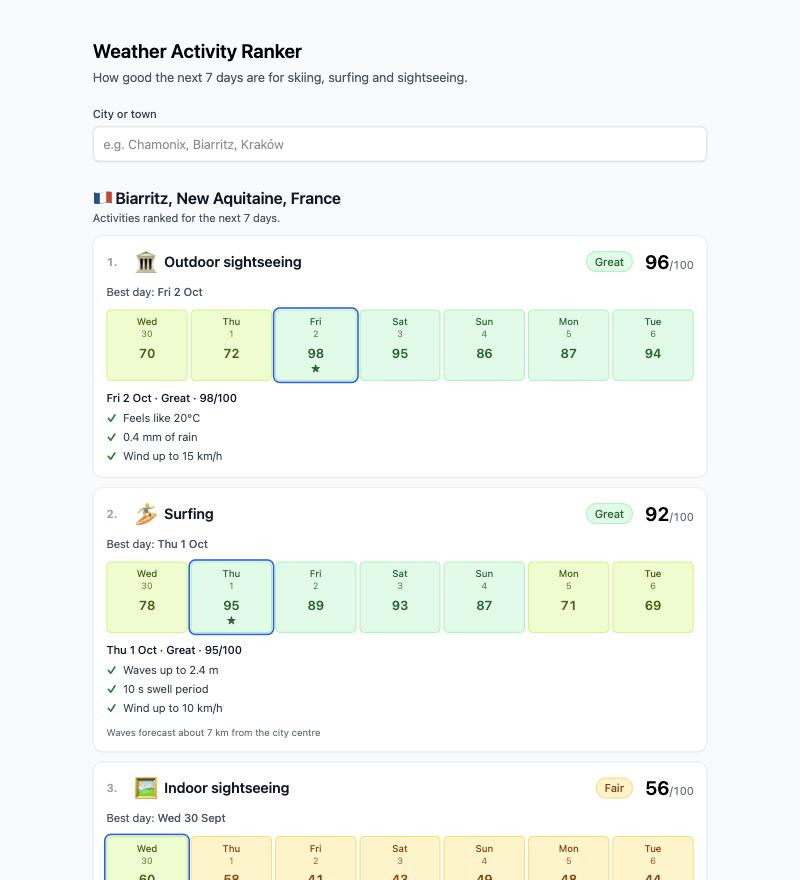

# Weather Activity Ranker

Enter a city or town and see how good the next 7 days are for **skiing, surfing, outdoor
sightseeing and indoor sightseeing**, based on [Open-Meteo](https://open-meteo.com/) forecasts.

**Live:** https://weather-activity-ranker-beta.vercel.app · GraphQL API: `POST /api/graphql`

Try: [Biarritz](https://weather-activity-ranker-beta.vercel.app/?place=3032797) (surf) ·
[Farellones, Chile](https://weather-activity-ranker-beta.vercel.app/?place=3889586) (ski season in
September) · [Warsaw](https://weather-activity-ranker-beta.vercel.app/?place=756135) (no coast, no snow)



## What it does

1. Search a place (autocomplete, disambiguated by region and country — there are many Parises).
2. The backend fetches the week's forecast, scores every day 0–100 for each activity and ranks the
   activities by how good the week is.
3. Each activity shows a label (Great / Good / Fair / Poor / Not possible), a 7-day strip, the best
   day, and the reasons behind the selected day's score ("149 cm snow base", "Heavy rain, 11.6 mm").
   Activities that can't happen this week ("No coast within about 25 km") sink to the bottom.

The selected place lives in the URL (`?place=<id>`), so results are shareable and survive refresh.

## Run it locally

Requires Node 22+.

```bash
npm install
npm run dev          # API on http://localhost:4010/api/graphql, web on http://localhost:5180
npm test             # server (65) + web (46) tests
npm run build:vercel # production build into .vercel/output (what Vercel deploys)
```

No API keys or environment variables are needed. `API_PORT` overrides the API port.

## How it's built

```
apps/
  server/   Node + GraphQL Yoga, TypeScript run directly by Node (type stripping)
    openMeteo/   geocoding, forecast, marine clients → normalized DayWeather per day
    scoring/     activity models (gates, weighted factors, caps) → ranked week
    graphql/     schema.graphql (the contract), resolvers, typed error codes
  web/      React 19 + React Compiler, Vite, Tailwind v4, TanStack Query
    features/place-search/       accessible combobox (ARIA 1.2 pattern)
    features/activity-forecast/  ranked cards, day strip, reason messages, states
    shared/                      typed GraphQL client, UI primitives, hooks, utils
scripts/build-vercel.mjs         Vercel Build Output API: static site + esbuild-bundled function
docs/                            PLAN, DECISIONS, SCORING
```

- **One schema, types everywhere.** `schema.graphql` generates resolver types for the server and
  query types for the web app (GraphQL Code Generator), so a change on one side that the other
  doesn't handle fails the build.
- **The API returns reason codes, not sentences** (`{ code: GUSTS, value: 65, impact: NEGATIVE }`);
  the frontend owns wording and units. Translating the UI is a frontend-only change.
- **Errors are part of the contract:** `BAD_USER_INPUT`, `PLACE_NOT_FOUND`, `UPSTREAM_UNAVAILABLE`
  in `extensions.code`; everything else is masked. The UI switches on codes and only offers
  "Try again" where retrying can help.
- **Deployment:** one Vercel project — static files on the CDN and the API as a single bundled
  serverless function at `/api/graphql`. No CORS, no always-on server.

## Scoring in short

Full reasoning, thresholds and the data checks behind them: [docs/SCORING.md](docs/SCORING.md).

- Each measurement maps to 0–1 through a piecewise-linear curve; a weighted sum gives 0–100.
- **Gates** make a day _Not possible_ (no snow base, flat sea, thunderstorm while surfing).
- **Caps** stop a day from scoring well without making it impossible (heavy rain for
  sightseeing, slushy snow for skiing) — added after tests showed a plain weighted sum let calm wind
  "compensate" for a downpour.
- A week's score is the **mean of its best 3 days** — "will I get a few good sessions this week".
- Indoor sightseeing is scored as the **alternative to outdoor**: best on days when outside is bad.

## Open product questions

Where I'd normally check with a PM. Each lists what I assumed and what could change; reasoning and
alternatives are in [docs/DECISIONS.md](docs/DECISIONS.md).

- **Who is the user — a holiday-maker or an enthusiast?** Assumed an average holiday-maker: e.g. a
  30 cm snow base is enough to ski, and waves over 5 m are _Not possible_. Experts would want different
  thresholds, or a skill-level switch.
- **How should a week be judged?** Assumed the mean of the best 3 days ("will I get a few good
  sessions"). A plain average would favour steady weeks; a single best day would favour one-off
  plans.
- **Where does skiing count as "near" a town?** Assumed the town's own conditions. Mountain valley
  towns (Innsbruck) and places with a glacier above town (Zermatt in September) show _Not possible_
  even though skiing is a short trip away. Worth deciding whether nearby ski areas should count.
- **How far from the sea is still "a surfing destination"?** Assumed about 25 km, and the UI says
  when waves are measured away from the city. Rome counts via its coast at Ostia; that may or may not
  match what users expect.
- **Is indoor sightseeing judged on its own or as the rainy-day alternative?** Assumed the
  alternative: it scores highest when outdoor conditions are poor. The most debatable call — a
  flat "always fine" score would make it useless for ranking, but users might read a _Fair_ indoor
  rating on a sunny day as "the museums are bad".
- **Should activities that can't happen be shown?** Assumed yes, at the bottom with the reason ("No
  coast within about 25 km"), so users learn why rather than wondering where surfing went.
- **Should search include airports, resorts and other non-towns?** Assumed yes, to avoid hiding ski
  resorts; the region and country make the results easy to tell apart.

## How I worked

I paired with Claude (Claude Code) through the whole task and kept the trail in the repo:

- **[docs/PLAN.md](docs/PLAN.md)** — the plan agreed before writing code, with a section on what
  changed during implementation. For every open question the model proposed options and I chose.
- **[docs/DECISIONS.md](docs/DECISIONS.md)** — a running log of question → decision → why, including
  decisions that were reversed.
- **[docs/SCORING.md](docs/SCORING.md)** — the domain research (what makes a good ski/surf day) and,
  more importantly, where I didn't take it at face value: every threshold was checked against real
  API responses, and scenario tests drove changes to the model.
- **Commit history** — one step per commit, in the order the work happened.

Things that changed because we checked rather than assumed:

- The planned "ring of probe points" to find the sea was dropped after testing showed the Marine API
  already snaps to the nearest sea cell.
- Snow depth switched to ECMWF after spotting a model-handover artifact in Zermatt.
- Scenario tests exposed the weighted-sum weakness → caps.
- In review I asked to move reason texts out of the scoring code; that became reason codes in the API.
- A GraphQL error-masking bug turned out to be two copies of `GraphQLError` (dual-package hazard) →
  graphql 16 + a test alias, documented in D15.

## Cuts and what I'd do next

Left out to stay within about half a day:

- **Wind direction for surfing** (offshore vs onshore) — needs coastline orientation per spot; biggest
  accuracy gain for surfing.
- **Mountain-aware skiing** — look up nearby ski areas (e.g. OpenStreetMap) and forecast at their
  elevation instead of the town's.
- **Forecast confidence** — day 7 counts the same as day 1; I'd show confidence rather than discount scores.
- **Runtime validation of Open-Meteo responses** (e.g. zod) at the API boundary; types are trusted today.
- **Server-side caching** of Open-Meteo responses (forecasts update hourly) if traffic grew.
- **Arrow-key navigation inside the day strip** (roving tabindex) — today each day is a Tab stop.
- **E2E tests** (Playwright) against the deployed app; current tests are unit, component and API level.
- **i18n** — the reason-code design makes it a frontend change, but only English exists.
